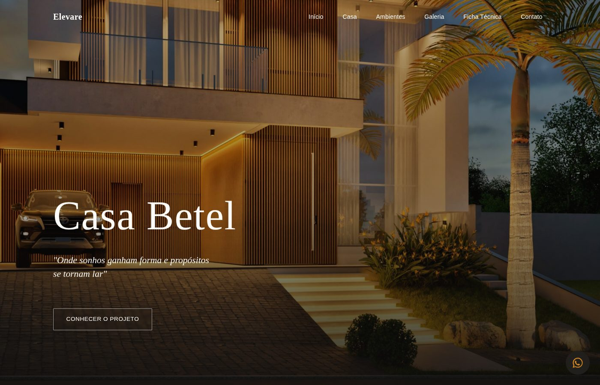

# Casa Betel — Elevare


Site de apresentação da Casa Betel, projeto residencial de alto padrão assinado pela construtora Elevare, em Pedra Branca, Palhoça/SC.

**Acesse o site publicado:** https://jvreinaldo.github.io/casa-betel-elevare/



## Sobre o projeto

Landing page one-page desenvolvida para apresentar a Casa Betel: a fachada, os ambientes internos e externos, a ficha técnica do projeto arquitetônico, um tour virtual em 360° e os canais de contato com a construtora.

O layout foi pensado para transmitir sofisticação sem perder a leitura fácil em qualquer tamanho de tela, com fotos reais em alta resolução do projeto e sem depender de nenhum framework.

## Funcionalidades

- Header fixo com navegação suave entre seções e menu adaptado para mobile
- Hero em tela cheia com a fachada da casa e chamada principal
- Seção "Casa" com a apresentação do imóvel
- Seção "Ambientes" com destaque para os principais cômodos
- Galeria com filtro por ambiente e visualização em tela cheia (lightbox), com navegação por teclado, botões e arraste (swipe) no celular
- Ficha técnica com a prancha oficial do projeto arquitetônico
- Tour virtual em 360°
- Contato direto via WhatsApp e Instagram
- Animações de entrada suaves ao rolar a página

## Tecnologias utilizadas

- HTML5 semântico
- CSS3 puro, com variáveis (custom properties), Flexbox e Grid
- JavaScript (ES Modules), sem frameworks ou bibliotecas externas
- Google Fonts (Fraunces, Marcellus e Inter)

## Estrutura do projeto

```
├── index.html
├── css/
│   ├── reset.css
│   ├── variables.css
│   ├── base.css
│   ├── components.css
│   └── sections.css
├── js/
│   ├── main.js
│   └── modules/
│       ├── menu.js
│       ├── gallery.js
│       └── scrollReveal.js
├── images/
│   ├── fachada/
│   ├── ambientes/
│   └── ficha-tecnica/
└── docs/
    └── preview.jpg
```

## Créditos

- **Construtora:** Elevare
- **Projeto arquitetônico:** Paulo André Reinaldo

## Autor

Desenvolvido por [João Victor Reinaldo](https://github.com/JVreinaldo).
